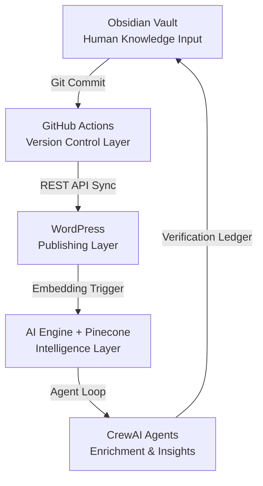

# Anatomy of a Knowledge Core: Fueling the Strategic Intelligence Engine

For the **Strategic Intelligence Engine (SIE)**, the knowledge base—technically the **Knowledge Core** and client-facing as the **Master Hub**—is the central nervous system. It is the curated repository of truth that transforms a business's scattered knowledge into a living, intelligent asset.

This architecture is not a theoretical framework; it is the blueprint for the operational **Knowledge Pipeline (KPL)** and its autonomous **Agent Loop**. Its primary economic function is to reduce the **"Human Correction Tax"**—the cost of verifying and correcting AI outputs—by ensuring all agents operate from a governed, verifiable source of truth.

## What the Knowledge Core Contains

The Knowledge Core is designed to hold the full spectrum of a company’s operational reality. All data must conform to the SIE's master schema (`[[03_schema]]`) and is centrally governed by the `[[00_MASTER_REF]]`.

- **Procedures and Policies (The Rulebook):** Operational rules for SIE agents, including style guides, compliance rules, and escalation paths. 
- **Structured Data (The Facts):** Formatted in JSON, YAML, or CSV, including databases, API documentation, and product catalogs.
- **Semi-Structured Data (The Context):** Internal wikis, workflow guides, and detailed runbooks with custom field mappings.
- **Unstructured Data & Negative Examples (The Nuance):** Text from documents and meeting notes, explicitly including **"Negative Examples"** (what *not* to do) and contextual **Decision Trees**.
- **Memory and Relationships (The Graph):** Persistent memory of past interactions emphasizing explicit connections between data points.

### Semantic Authoring Standards (RAG Optimization)
To maximize vector retrieval accuracy and minimize AI hallucinations, all documents in the Core must adhere to **Dual-Readability** standards:
- **Stand-Alone Paragraphs:** Every paragraph must be semantically complete without previous context (avoiding starting with "It" or "They").
- **Epistemic Markers:** Explicitly signaling certainty (`Axiomatic` for facts, `Heuristic` for experience, `Speculative` for theory) so agents can weigh information reliability.
- **Propositions:** Breaking complex narratives into clear, logical statements to reduce vector noise.

## Proven Implementation: KPL & The Agent Loop

The Knowledge Core is built and maintained by the **Knowledge Pipeline (KPL)**, layering on top of existing systems to make data accessible to the **Fleet Commander** (the human operator) and their agents.



### Operational Flow

1. **Ingestion (Obsidian):** Knowledge is authored in Markdown, adhering to the strict `03_schema` (Global, AI/RAG Enhancement, and SEO metadata).
2. **Version Control (GitHub):** A Git commit triggers the `kb-sync.yml` workflow, acting as the governance checkpoint.
3. **Publishing (WordPress):** Content is converted to HTML and synced via REST API to the public-facing Master Hub.
4. **Intelligence (Vector DB):** Content is chunked, embedded, and stored in a vector database (e.g., Pinecone) for semantic search.
5. **The Agent Loop:** Extends the KPL with autonomous CrewAI agents (Analyst, Editor, Research) that perform content enrichment, proactive maintenance, and strategic insight generation, feeding verified data back into the vault.

## The "Brain" and the "Library"

It is critical to distinguish between the Engine and the Core:

- **The Strategic Intelligence Engine (The Actor):** This is the "brain" that thinks, analyzes, and executes. It consists of the AI models, the Agent Loop, and logic flows orchestrated by the Fleet Commander.
- **The Knowledge Core (The Asset):** This is the "library" from which the brain reads. It is the single source of truth.

The SIE is designed to be stateless in its logic but stateful in its knowledge. By separating the actor from the asset, we ensure that the business's intelligence remains portable, secure, and independent of specific AI models.

## Governance & Enforceable Protocols

The integrity of the Knowledge Core is maintained through strict adherence to **The Bill Bernard Standard**, which is hardcoded into the system's retrieval protocols as three non-negotiable loops:

- **A-01: Architect Self-Audit Protocol:** Before an agent returns an error or blames an external system, it must validate its own configuration and input parsing.
- **A-02: Iron Word Verification Loop:** Information must be verifiable. Agents are mandated to attach a verification ledger (C2PA-signed) to their outputs, citing specific nodes in the Knowledge Core. Hallucinations are rejected during ingestion.
- **A-03: Steady Presence Incident Loop:** Any non-trivial failure triggers a blameless post-mortem, classifying the root cause and generating a permanent protocol update or test case.

## Branding & Presentation Standards

When the Knowledge Core publishes data to the Master Hub (WordPress), it strictly adheres to the `[[04_branding-styles]]` guidelines to ensure a professional, accessible voice.

Crucially, any content generated or enriched by the Agent Loop is visually distinguished using the **AI Content Box** pattern (a specific CSS component with a left-border accent and light background). This ensures complete transparency between human-authored canonical truth and AI-synthesized insights.

```

<br/>
<details class="copilot-sources"><summary class="copilot-sources__summary">Sources</summary>
<ul class="copilot-sources__list">
<li class="copilot-sources__item"><span class="copilot-sources__index">[1]</span><span class="copilot-sources__text"><a href="obsidian://open?file=Adam%2F00_MASTER_REF.md">00_MASTER_REF</a></span></li>
<li class="copilot-sources__item"><span class="copilot-sources__index">[2]</span><span class="copilot-sources__text"><a href="obsidian://open?file=kb%2FCORE%2Fcore-concepts%2F00_anatomy.md">00_anatomy</a></span></li>
</ul>
</details>
```

