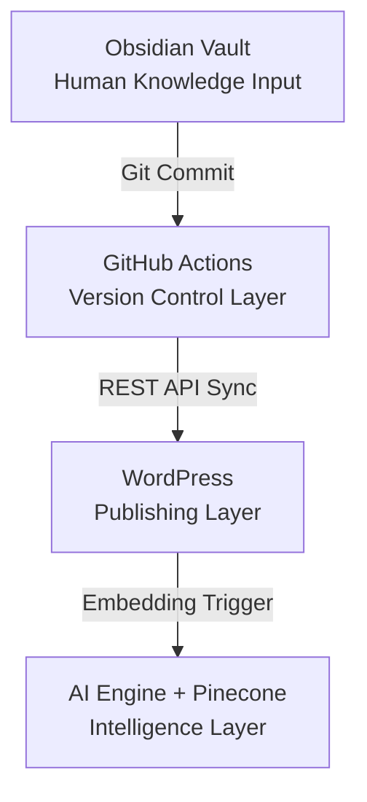

# Anatomy of a Knowledge Core: Fueling the Strategic Intelligence Engine

For the **Strategic Intelligence Engine (SIE)**, the knowledge base—technically the **Knowledge Core** and client-facing as the **Master Hub**—is the central nervous system. It is the curated repository of truth that transforms a business's scattered knowledge into a living, intelligent asset.

This architecture is not a theoretical framework; it is the blueprint for the operational **Knowledge Pipeline (KPL)**. Its primary economic function is to reduce the **"Human Correction Tax"**—the cost of verifying and correcting AI outputs—by ensuring all agents operate from a governed, verifiable source of truth.

## What the Knowledge Core Contains

The Knowledge Core is designed to hold the full spectrum of a company’s operational reality. All data must conform to the SIE's master schema (`03_schema`) to be ingested.

-   **Procedures and Policies (The Rulebook):** These are the operational rules for SIE agents. This includes style guides, compliance rules, and escalation paths. Crucially, these rules directly enforce the **Architect Self-Audit Protocol**, ensuring agents check their constraints before executing tasks.

-   **Structured Data (The Facts):** Formatted in JSON, YAML, or CSV, this includes databases, API documentation, product catalogs, and service-level agreements. This machine-readable data is critical for tasks requiring precise, factual information.

-   **Semi-Structured Data (The Context):** This includes internal wikis, workflow guides, and detailed runbooks. Custom field mappings are used to define relationships between data points, allowing agents to interpret context beyond the raw data.

-   **Unstructured Data & Negative Examples (The Nuance):** This includes text from documents, meeting notes, and PDFs. Crucially, the Core also includes **"Negative Examples"**—explicit instructions on what *not* to say or do—and contextual **Decision Trees** to help agents navigate edge cases without human intervention.

-   **Memory and Relationships (The Graph):** The Knowledge Core maintains persistent memory of past interactions to ensure continuity. It emphasizes explicit connections between data points, creating a rich knowledge graph rather than a simple collection of documents.

## Proven Implementation: The Knowledge Pipeline (KPL)

The Knowledge Core is built and maintained by the **Knowledge Pipeline (KPL)**, the SIE's first proven operational implementation. This architecture layers on top of existing systems, using APIs to make data accessible to the **Fleet Commander** (the human operator) and their agents.

The KPL's validated architecture is as follows:

 
 ### Operational Flow

1. **Ingestion (Obsidian):** Knowledge is authored in Markdown within the local vault, adhering to the strict `03_schema`. This ensures all data is structured before it ever enters the pipeline.
2. **Version Control (GitHub):** A Git commit triggers the `kb-sync.yml` workflow. This layer acts as the governance checkpoint, ensuring a complete history of changes and enabling rollback capabilities.
3. **Publishing (WordPress):** The content is converted to HTML and synced via REST API to the public-facing Master Hub.
4. **Intelligence (Vector DB):** Simultaneously, the content is chunked, embedded, and stored in a vector database (e.g., Pinecone). This transforms the text into mathematical vectors, making the Knowledge Core semantically searchable by AI agents.

## The "Brain" and the "Library"

It is critical to distinguish between the Engine and the Core:

- **The Strategic Intelligence Engine (The Actor):** This is the "brain" that thinks, analyzes, and executes. It consists of the AI models, agents, and logic flows orchestrated by the Fleet Commander.
- **The Knowledge Core (The Asset):** This is the "library" from which the brain reads. It is the single source of truth.

The SIE is designed to be stateless in its logic but stateful in its knowledge. By separating the actor from the asset, we ensure that the business's intelligence (the Core) remains portable, secure, and independent of the specific AI models used to process it.

## Governance & Standards

The integrity of the Knowledge Core is maintained through strict adherence to **The Bill Bernard Standard** ([01_ABX-Bill-Bernard-Standards](app://obsidian.md/01_ABX-Bill-Bernard-Standards)), which is hardcoded into the system's retrieval protocols.

- **The Iron Word (Verification Loop):** Information in the Core must be verifiable. Agents are mandated to attach a verification ledger to their outputs, citing specific nodes in the Knowledge Core. Hallucinations or unverified data are rejected during the ingestion phase.
- **The Quiet Hand (Stewardship):** The system works in the background to maintain structure, automatically tagging and linking new entries to existing concepts to prevent data decay.

This governance ensures that as the Knowledge Core grows, it becomes a **Data Moat** ([kb/CORE/core-concepts/04_the-data-moat](app://obsidian.md/kb/CORE/core-concepts/04_the-data-moat))—a defensible competitive advantage that cannot be easily replicated by competitors.