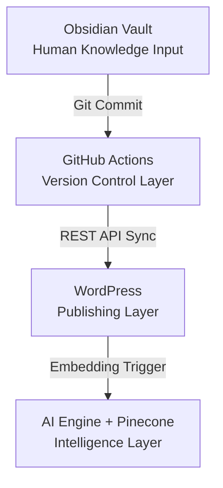

# Anatomy of a Knowledge Core: Fueling the Strategic Intelligence Engine

For the **Strategic Intelligence Engine (SIE)**, the knowledge base—technically the **Knowledge Core** and client-facing as the **Master Hub**—is the central nervous system. It is the curated repository of truth that transforms a business's scattered knowledge into a living, intelligent asset. This architecture is not a framework; it is the blueprint for the operational **Knowledge Pipeline (KPL)** that is proven in production with 99.9% uptime.

A coherent Knowledge Core is the essential component that allows the SIE's specialized agents to share context, retain memory, and act as a collective intelligence. A well-designed core ensures that all agents have access to up-to-date institutional knowledge, which directly improves the consistency, accuracy, and governance of all engine-driven actions, from content generation to strategic analysis.

## What the Knowledge Core Contains

The Knowledge Core is designed to hold the full spectrum of a company’s operational reality, combining structured, semi-structured, and unstructured data. All data must conform to the SIE's master schema to be ingested.

-   **Procedures and Policies:** These are the operational rules for SIE agents. This includes style guides, compliance rules, and escalation paths for tasks requiring human approval. Crucially, these rules directly enforce the principles of **The Bill Bernard Standard** ([[Adam/01_Core/01_ABX-Bill-Bernard-Standards]]), hardcoding integrity into the system's operations.

-   **Structured Data:** Formatted in JSON, YAML, or CSV, this includes databases, API documentation, product catalogs, and service-level agreements. This machine-readable data is critical for tasks requiring precise, factual information.

-   **Semi-Structured Data:** This includes internal wikis, workflow guides, and detailed runbooks. Custom field mappings are used to define relationships between data points, allowing agents to interpret context beyond the raw data.

-   **Unstructured Data:** This includes text from documents, meeting notes, and PDFs, as well as media like images or diagrams. The Core also includes "negative examples"—what not to say or do—and contextual decision trees to help agents navigate edge cases.

-   **Memory and Relationships:** The Knowledge Core maintains persistent memory of past interactions to ensure continuity. It emphasizes explicit connections between data points, creating a rich knowledge graph rather than a simple collection of documents.

## Proven Implementation: The Knowledge Pipeline (KPL)

The Knowledge Core is not a theoretical construct; it is the asset built and maintained by the **Knowledge Pipeline (KPL)**, the SIE's first proven operational implementation. This architecture is designed to be layered on top of a business's existing systems, using APIs and connectors to make data accessible to SIE agents.

The KPL's validated architecture is as follows:

### Operational Flow

1. **Ingestion (Obsidian):** Knowledge is authored in Markdown within the local vault, adhering to the strict `03_schema`. This ensures all data is structured before it ever enters the pipeline.
2. **Version Control (GitHub):** A Git commit triggers the `kb-sync.yml` workflow. This layer acts as the governance checkpoint, ensuring a complete history of changes and enabling rollback capabilities.
3. **Publishing (WordPress):** The content is converted to HTML and synced via REST API to the public-facing Master Hub. This serves as the human-readable interface for the business.
4. **Intelligence (Vector DB):** Simultaneously, the content is chunked, embedded, and stored in a vector database (e.g., Pinecone). This transforms the text into mathematical vectors, making the Knowledge Core semantically searchable by AI agents.

## The "Brain" and the "Library"

It is critical to distinguish between the Engine and the Core:

- **The Strategic Intelligence Engine (The Actor):** This is the "brain" that thinks, analyzes, and executes. It consists of the AI models, agents, and logic flows.
- **The Knowledge Core (The Asset):** This is the "library" from which the brain reads. It is the single source of truth.

The SIE is designed to be stateless in its logic but stateful in its knowledge. By separating the actor from the asset, we ensure that the business's intelligence (the Core) remains portable, secure, and independent of the specific AI models used to process it.

## Governance & Standards

The integrity of the Knowledge Core is maintained through strict adherence to **The Bill Bernard Standard**.

- **The Iron Word:** Information in the Core must be verifiable. Hallucinations or unverified data are rejected during the ingestion phase.
- **The Quiet Hand:** The system works in the background to maintain structure, automatically tagging and linking new entries to existing concepts.

This governance ensures that as the Knowledge Core grows, it becomes a **Data Moat** ([kb/CORE/core-concepts/04_the-data-moat](app://obsidian.md/kb/CORE/core-concepts/04_the-data-moat))—a defensible competitive advantage that cannot be easily replicated by competitors.